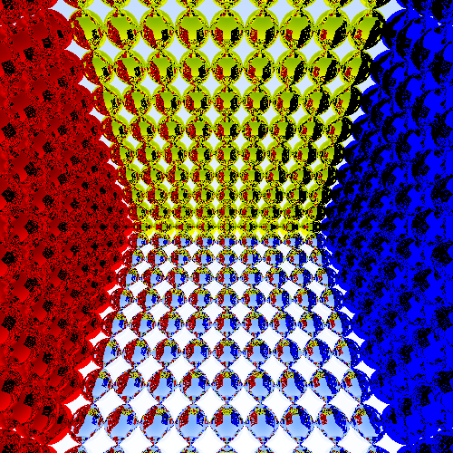

# Performance comparison of parallel ray tracing in functional programming languages

This repository is an embryonic collection of ray tracers written with
parallel functional programming techniques.  The intent is to
investigate, on a rather small and simple problem, to which degree
functional programming lives up to the frequent promise of easy
parallelism, and whether the resulting code is actually fast in an
objective sense.  The benchmarking technique is mostly crude, so
assume only large relative differences are meaningful.  I welcome
contributions, as I have little confidence that any of my code is
optimal.  I am an expert in *at most* one of the languages on
exhibition here.  I also welcome new implementations in other
languages!

Note also that this is not a **good** ray tracer.  It does not
generate particularly pretty images.  It's chosen simply because it
expresses two interesting kinds of parallelism (see below), and
because even an ugly image is more interesting than just a number.
Two scenes are used.  The first is **rgbbox**:

The second is **irreg**:

This second scene is interesting because the load is unbalanced: all
objects are in the lower half of the pixels.

For each scene, two things are benchmarked:

1. Constructing a
   [BVH](https://en.wikipedia.org/wiki/Bounding_volume_hierarchy) of
   the scene.  This is interesting because it is a divide-and-conquer
   task parallel problem.

2. Actually rendering the scene, accelerated by the BVH.  This is
   mostly straightforward data parallelism, but with a potentially
   beefy amount of work for each pixel.

## Results

The following measurements are for 1000x1000 renderings.  I used a
Ryzen 1700X (8 cores, 16 threads) CPU and a Vega 64 GPU.  **Compare
numbers within the same column.**

Language | rgbbox (BVH) | rgbbox (render) | irreg (BVH) | irreg (render)
-------- | ------------ | --------------- | ----------- | --------------
[F#](fsharp/)             | 0.4ms |  826ms |  5.6ms |  434ms
[Futhark (GPU)](futhark/) | 3.5ms |   30ms |  3.6ms |   16ms
[Futhark (CPU)](futhark/) |11.5ms |  241ms | 18.3ms |   94ms
[Haskell](haskell/)       | 0.6ms |  372ms |  8.5ms |  195ms
[MPL][mpl]                | 0.4ms |  341ms |  9.4ms |  112ms
[OCaml](ocaml/)           | 1.3ms |  723ms |   15ms |  240ms
[Rust](rust/)             | 0.1ms |  248ms |  1.1ms |   98ms
[Scala](scala/)           | 0.2ms |  594ms |  4.3ms |  251ms

[mpl]: https://github.com/MPLLang/mpl/blob/master/examples/src/ray.sml

## Commentary

The Haskell implementation uses the `Strict` language pragma to
disable laziness in the core modules.  This has about 1.5-2x impact on
the run-time.  The
[massiv](https://hackage.haskell.org/package/massiv-0.5.1.0) library
is used for parallel arrays and is the source of most of the
performance.

After a few false starts, F# runs quite fast when using .NET Core.
The main tricks appear to be [using inline functions and explicit
value types](https://github.com/athas/raytracers/pull/12).

MPL (which is a parallelism-oriented fork of
[MLton](http://mlton.org/) for Standard ML) is definitely the star
here.  The code is readable, written in a completely natural style,
and performance is excellent.

Multicore OCaml is also quite fast, and the code is likewise very
clean.

While the implementations are allowed to use single-precision floating
point if they wish, the Scala implementation is actually [much faster
when using double
precision](https://github.com/athas/raytracers/pull/24).

While Futhark is fast, the code is significantly longer and more
complex.  This is particularly because of the BVH construction.  In
all other implementations, the BVH is expressed as a straightforward
recursive divide-and-conquer function, which is also easy to
parallelise with fork-join techniques.  Since Futhark does not support
recursion, it instead uses a bottom-up technique presented by Tero
Karras in the paper [Maximizing Parallelism in the Construction of
BVHs, Octrees, and *k*-d
Trees](https://research.nvidia.com/sites/default/files/publications/karras2012hpg_paper.pdf).
This is actually a pretty fast technique (although not for the small
scenes used here), but it is about two hundred lines longer than the
recursive formulation.  The CPU timings use an [early experimental
multicore backend](https://github.com/diku-dk/futhark/tree/multicore)
and `clang` for compiling the C code.

Rust is the fastest CPU language.  This is not terribly surprising, as
it has a mature compiler, and its default behaviour of unboxing
everything is exactly what you need for this program.

What is not visible from the above table is that most of the
implementations were significantly slower in their original
formulation.  Only Futhark, MPL, and Rust are essentially unchanged
from their first straightforward implementation.  For the others, most
of the performance comes down to various low-level tweaks, in
particular avoiding boxing and allocations.  This is not exactly
unexpected, but I still find it sad that when it comes to performance
in functional languages, we must think about the *compiler* more than
we think about the *language*.

## See also

Jon Harrop's [Ray tracer language
comparison](https://www.ffconsultancy.com/languages/ray_tracer/index.html)
is an inspiration for this page.  The main difference is that I focus
on parallelism.  The ray tracer here also requires the construction of
an explicit BVH from scene data, while Jon Harrop's ray tracer used a
functional formulation to describe the recursive structure of his
scene.
